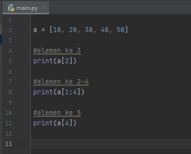

Praktikum 4 

#LATIHAN 7

##Latihan 1.py

**Soal**
- Buat program dengan perulangan bertingkat(_nested_) for yang menghasilhan output sebagai berikut:

**Jawaban**
- berikut merupakan koding beserta sedikit penjelasannya

**Pejelasan singkat dari beberapa fungsi yang dipakai** :
- `print()` : berfungsi untuk mencetak atau menampilkan objek ke perangkat keluaran (layar) atau ke file teks.
- `for` : Looping/pengulangan.
- `range()` : merupakan fungsi yang menghasilkan list. Fungsi ini akan menciptakan sebuah list baru dengan rentang nilai tertentu.

**Output Latihan 1.py**

##Latihan 2.py
**Soal**
- Tampilkan n bilangan acak lebih kecil dari 0,5
- Nilai n diisi saat runtime
- Anda bisa menggunakan kominasi `while` dan `for` untuk menyelesaikannya

**Jawaban**
- berikut merupakan koding latihan 2.py

**Pejelasan singkat dari beberapa fungsi yang dipakai** :
- `print()` : berfungsi untuk mencetak atau menampilkan objek ke perangkat keluaran (layar) atau ke file teks.
- `for` : Looping/pengulangan.
- `import` : fungsi lanjut yang dipanggil oleh statement import.
- `random` : fungsi lanjut yang dipanggil oleh statement import.
- `range()` : merupakan fungsi yang menghasilkan list. Fungsi ini akan menciptakan sebuah list baru dengan rentang nilai tertentu.
- `uniform()` : fungsi lanjut yang dipanggil oleh statement import.

**Output Latihan 2.py**

>Catatan: Mengapa output latihan 2.py tidak sama seperti di contoh soal? Karena fungsi `random` sehingga angka yang muncul merupakan angka random/acak

